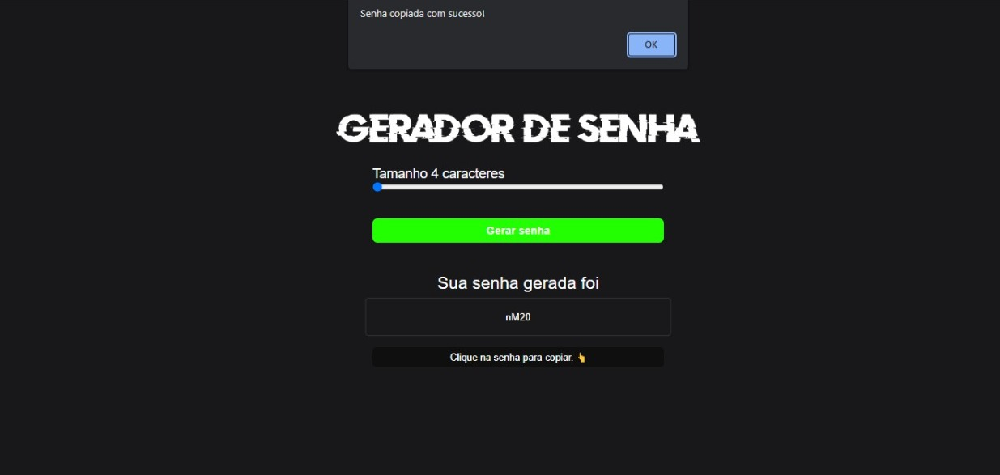

# projeto<h1 align="center"> Card Produtos </h1>

  

 

## 🚀 Tecnologias

Esse projeto foi desenvolvido com as seguintes tecnologias:

## 💻 Projeto

O progetop gerador de senha e um sistema que gera senha e copia ao click 

- [Acesse o projeto finalizado, online](https://renatodev23.github.io/gerador-de-senha)

## Licença

Esse projeto está sob a licença MIT.

---
